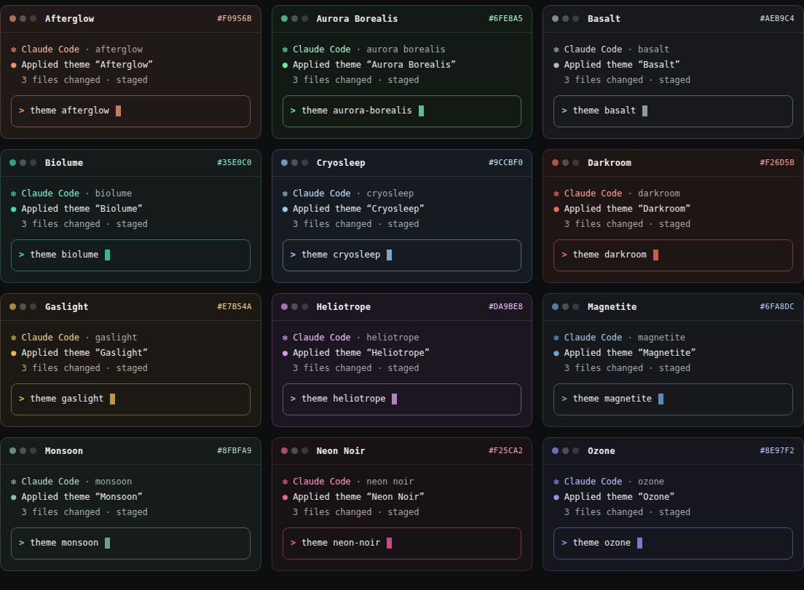

# Dark Themes Vol. 2 for Claude Code

Twelve new hand-tuned dark themes that expand the original
[50 Dark Themes](https://github.com/notgabriels-sys/claude-code-50-dark-themes) pack.
Same semantic status colors, same contrast standards (AAA primary text, AA secondary),
all-new palettes. Free and MIT licensed.



```text
/plugin marketplace add notgabriels-sys/claude-code-50-dark-themes
/plugin install dark-themes-vol-2@notgabriels-themes
```

Run `/theme` and select any theme from the pack. Plugin themes are read-only; press `Ctrl+E` on one
to copy it into `~/.claude/themes/` for editing.

## The themes

| Theme | Mood |
|---|---|
| Afterglow | Warm peach dusk after the sun drops |
| Aurora Borealis | Mint-green light over a black sky |
| Basalt | Cooled volcanic stone, steel-gray monochrome |
| Biolume | Bioluminescent teal in deep water |
| Cryosleep | Pale ice-blue stasis chamber |
| Darkroom | Photographic safelight red-amber |
| Gaslight | Victorian gas-lamp amber |
| Heliotrope | Violet-pink garden at night |
| Magnetite | Dark iron with a magnetic blue pull |
| Monsoon | Rain-washed green-gray |
| Neon Noir | Magenta signage on wet asphalt |
| Ozone | Electric periwinkle after the storm |

Visual gallery for the original 50: https://gabs-utilities.com/

Source and manual installation: https://github.com/notgabriels-sys/claude-code-50-dark-themes
